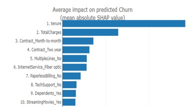
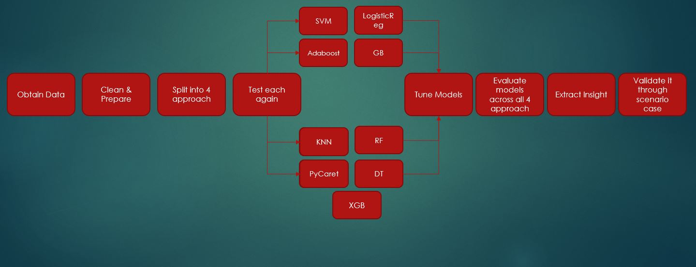
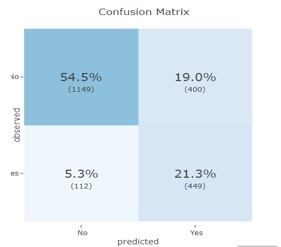
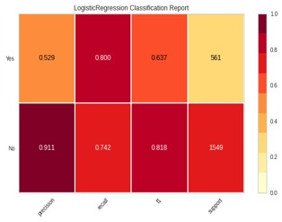
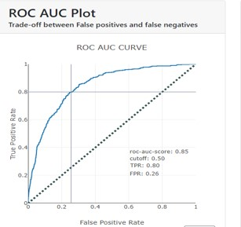
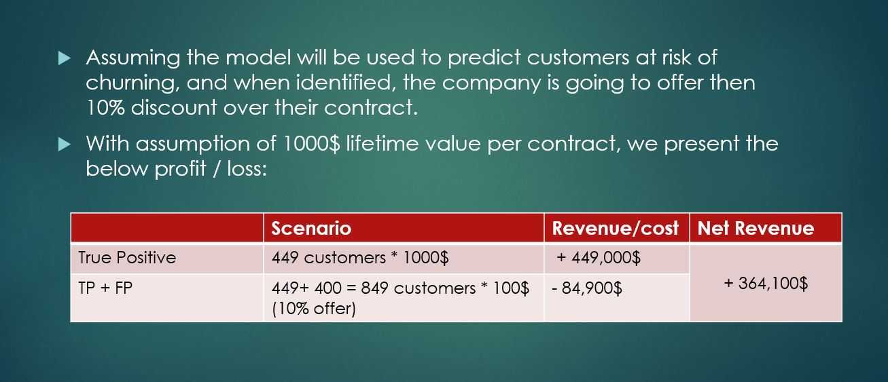

# Telecom customer's churn using machine learning

## Summary

**Motivation:** As part of my data science bootcamps projects, we intent to perform "customer churn modeling" for company within the telecom industry
 
 **Goal:** The goal is to test and train multiple machine learning models in order to select the one with most valid business case
 
 **Business Case:** The company will be using this model to predict customers at risk of churning. hypothetical case was:
 1- The contract's life time value is 1000$
 2- Customers at risk of churning will be called and offered 10% discount if they maintain/continue their contract
 3- based on the model results, what is the net effect on the company's income statement
 
 **Next Steps:** 
 - Test if customer's location has any impact on customer's behaviour
 - Test if manipulating correlated features will have impact on customer's behaviour and subsequently churning rate
 - Expand more on hyperparameter tuning
 - Expand more on feature importance and selection
 

## Introduction
The approach was as following

## Models tested
The following Machine learning models were tested:

 - Logistic Regression
 - SVM
 - KNN
 - RandomForest
 - AdaBoost
 - Gradient Boost
 - Decision Tree
 - XGBoost
 - PyCaret classification module

## Model chosen:

Logistic Regression with the following results:

 
 

## Business Case clarification:

