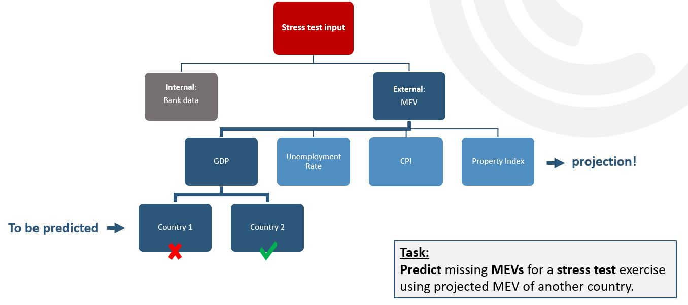
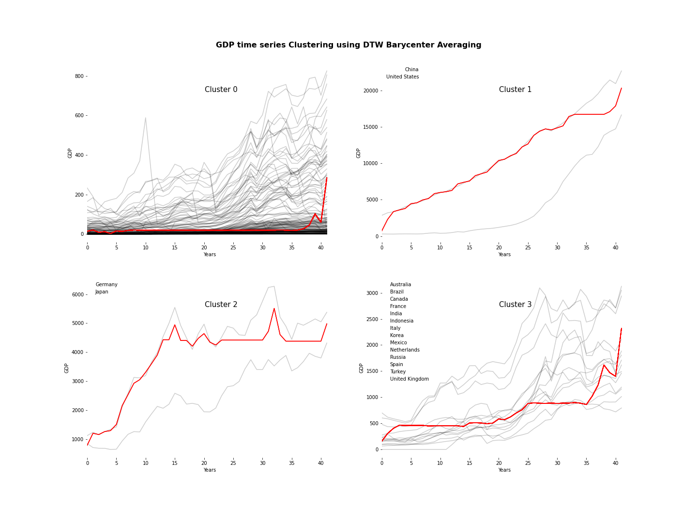
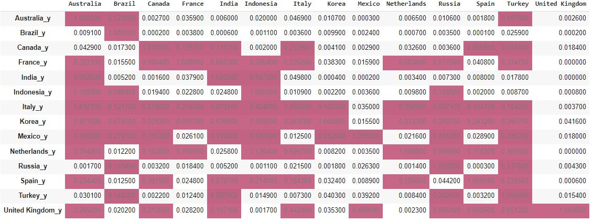
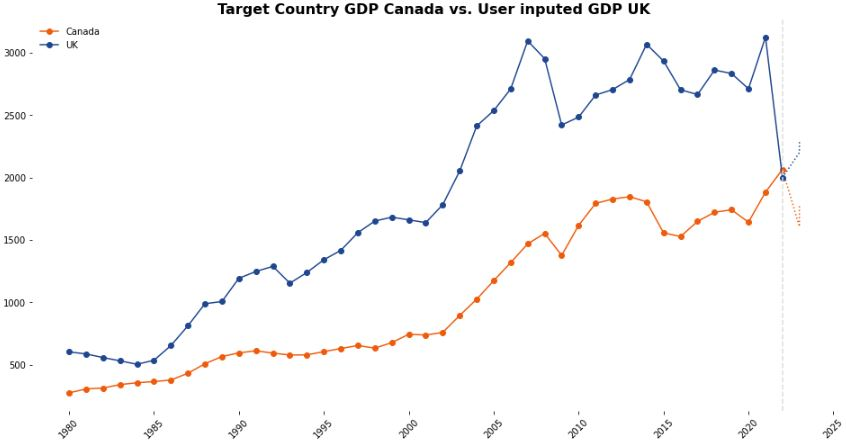
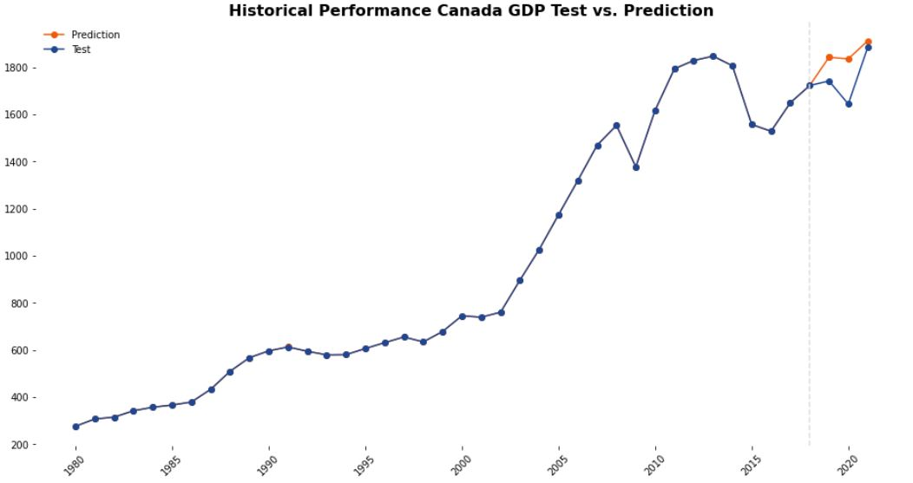

# Macroeconomic forecasting using machine learning methods
---
This folder contains all the relevant notebooks covering the building of end-to-end prediction system to forecats macroeconomic variables of selected countries under so-called "Stress Scenario" - please read the purpose for more details.
folders:
- Final Presenation: contain final presentation of project and its step-by-step approach
- notebooks: all notebooks, including the ones we used to test other appraoch using both:
	- IMF annual data
	- FRED quarterly data

**for the final approach presented in the slides**:

- annual_imf_all_countries_FULL_RUN.ipynb
- annual_imf_all_countries_fbProphet.ipynb
- annual_imf_all_counties_timeSeries_clustering_Regression.ipynb

# Authors
---
- [Patrizia Will](https://www.linkedin.com/in/patrizia-will/)
- [Hussam Al-Homsi](https://www.linkedin.com/in/hussam-al-homsi/)

# Supervisors
---
- [Ekaterina Butyugina](https://www.linkedin.com/in/ekaterina-butyugina/)
- [ansam zedan](https://www.linkedin.com/in/ansam-zedan/)
- [Dipanjan (DJ) Sarkar](https://www.linkedin.com/in/dipanzan/)

# Purpose
---
Build Machine learning models capable of predicting macroeconomic variables in so-called "stress situations" ultimately it will be used as an input to a "Stress Test Exercise" within banking industry.

Stress test is an exercise aim to test bank‘s capital adequacy in times of economic shock (or stressful situation). In another word, if the economy collapsed or went into recession and people started losing their jobs/income how long can the bank‘s capital carry it forward.
Two type of inputs need to perform such stress exercise: 
- Bank‘s own financial data
- Projection of economic variables in stress condition (for all the countries that the bank has exposure to)

To learn more about stress testing exercise and its importance in stabilizing economies check this link: [UK Central Bank Demo](https://www.bankofengland.co.uk/stress-testing)

The issue is not all countries publicly disclose their projections to what their economic variables can look like in stressful scenario. Our project tasks is: Given that we have some projections to few countries, how can we predict the unavailable projections.

# Data
---
Publicly available International Monetary Fund Database, [Full Dataset is here](https://www.imf.org/en/Data)

# Example Results
---

### In This Example:
- Target Country is **Canada**
- Target Macroeconomic Variable: **GDP**
- **Granger Causality Test** to filter out countries with weak predictive power toward our target country/economic variable
- Forecasting performance: Assuming the user were able to obtain only UK GDP preojection and would like to use it as input to guid the prediction of canadaian GDP under **Stress Scenario**
- Historical Performance 

